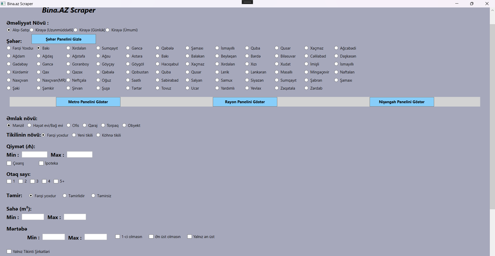

# BinaScraperApp — Bina.az üçün WPF Scraper

ScraperBina.az, Bina.az platformasındakı daşınmaz əmlak elanlarını toplamaq üçün hazırlanmış Windows (WPF, C#) tətbiqidir. 

---

  

## Tələblər

- Windows OS
- Visual Studio 2022 və ya üstü
- .NET 8 və ya üstü
- Microsoft Edge brauzer (Playwright üçün)
- Microsoft.Playwright Version = 1.57.0
- ClosedXML Version = 0.105.0
  
---

## İstifadə

- UI üzərindən lazım olan filtr təyin edin (Saytdakı Bütün Filterlər mövcuddur).
- Elan sayını axtarın
- Scrape etmək istədyiniz elan sayını daxil edin və qeyd olunma formatını (Excel,CSV) seçin.
- Prosesini başladın.
- Yaddaşa yazılan elanlar ...bin\Debug\net8.0-windows\output qovluğunun içinə yazılır 

---

## Əlavə qeydlər

- Browser açıq olsun seçildikdə, Browserdəki prosesləri bir başa görə bilərsiniz. (Prosesin vaxtını uzada bilər!)
- Hər 5 elandan bir elanlar yaddaşa yazılır

---

## Hüquqi və etik qeyd

- Yalnız şəxsi/araşdırma məqsədləri üçün və qanuni çərçivədə istifadə edin.

---

